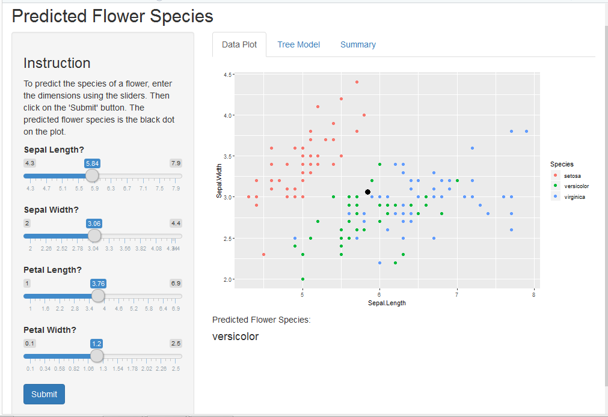
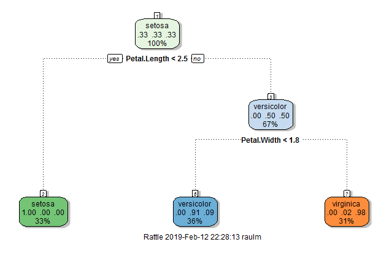
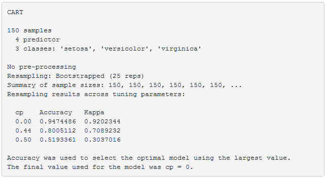

Developing Data Products
========================================================
author: R. Martinez
date: February, 2019
autosize: true

Introduction
========================================================

The purpose of this project is to build a Shiny Application and build this presentation using RStudio Presenter. 
  
The Application built is a **Tree Model** to predict the speacies of flowers. I use the **"iris"** dataset that comes with the R basic package.
  
Follows is the link to the GitHub repository where the reader will find all the R files for the application (ui.R and server.R), and source code for this presentation:
<https://github.com/graulm/Developing-Data-Products-Final-Project>  

Link ot the Application: <https://sraulm.shinyapps.io/rmApp/>

The "iris" dataset
========================================================

Follows are the first few rows of the **"iris"** dataset:

| Sepal.Length| Sepal.Width| Petal.Length| Petal.Width|Species |
|------------:|-----------:|------------:|-----------:|:-------|
|          5.1|         3.5|          1.4|         0.2|setosa  |
|          4.9|         3.0|          1.4|         0.2|setosa  |
|          4.7|         3.2|          1.3|         0.2|setosa  |
|          4.6|         3.1|          1.5|         0.2|setosa  |
|          5.0|         3.6|          1.4|         0.2|setosa  |
|          5.4|         3.9|          1.7|         0.4|setosa  |
  
The first four columns of the dataset are the predictor features while the column on the right "Species" is the value we are trying to predict with the Tree Model.
Using the application built here, the reader will be able to enter values for each of the features, and the application will predict the species given those values.

The Application
========================================================
  
This is the main page of the application where the reader can see the "iris" plot on the right. The sliders on the left can be used to set the values for each of the features. Once all the values are set, click on the "submit" button to tell the application to predit the species of the flower. The predicted value will be shown on the plot as a black dot.  

***

The Tree Model and Summary Tabs
========================================================
  
Note that the main page of the application there are two other tabs **Tree Model** and **Summary**. If you click on them you will see a graphical representation of the tree model,  and the summary of the model. On the right you can see a print screen of those tabs.   

***
  

  

